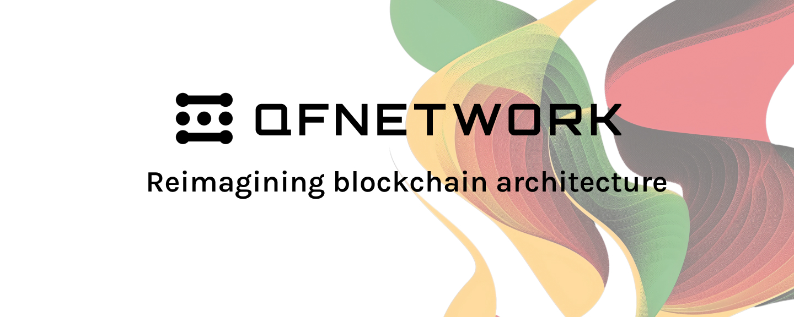

# Quantum Fusion

 

 

For contributing to this project, please read [Contributing](#contributing) section.

# QF PolkaVM SDK

This framework allows to implement contracts for Quantum Fusion Network.

## Run examples

To run examples or other smart contracts first need to have install [qf-solochain](https://github.com/QuantumFusion-network/qf-solochain) or via [portal](http://portal.qfnetwork.xyz/).

## Executables and runtimes

This section describes the project's executables and runtimes and provides step-by-step instructions
 for running a local testnet. This guide is suitable for advanced users.
See [docs/executables_and_runtimes.md](docs/executables_and_runtimes.md).

## Compiling Smart Contracts for PolkaVM

Please read section [Compiling Smart Contracts for PolkaVM](https://github.com/QuantumFusion-network/qf-solochain/blob/main/README.md).

## Contributing

We welcome contributions of all kinds! Whether you're reporting or fixing a bug, adding a feature, or improving
documentation, your help is greatly appreciated. For a bug or vulnerability report please [open a new issue](https://github.com/QuantumFusion-network/qf-polkavm-sdk/issues).

For code contributions please follow these steps:

1. Fork the repository and create a new branch following the format `your-github-name/descriptive-branch-name` (e.g., `qf-polkavm-sdk/fix-123`).
2. Make smaller commits with clear messages to simplify reviewer's work.
3. Submit a pull request targeting `main` branch and provide a concise description of your changes.

By contributing, you agree to adhere to our [Contributor Covenant Code of Conduct](./CODE_OF_CONDUCT.md), which fosters
a respectful and inclusive environment.

We appreciate your support and look forward to your contributions! 🚀

[^1]: <https://forum.polkadot.network/t/announcing-polkavm-a-new-risc-v-based-vm-for-smart-contracts-and-possibly-more/3811#the-compilation-pipeline-7> "The compilation pipeline".
[^2]: <https://github.com/paritytech/polkadot-sdk/tree/master/substrate/bin/utils/chain-spec-builder> "chain-spec-builder".
